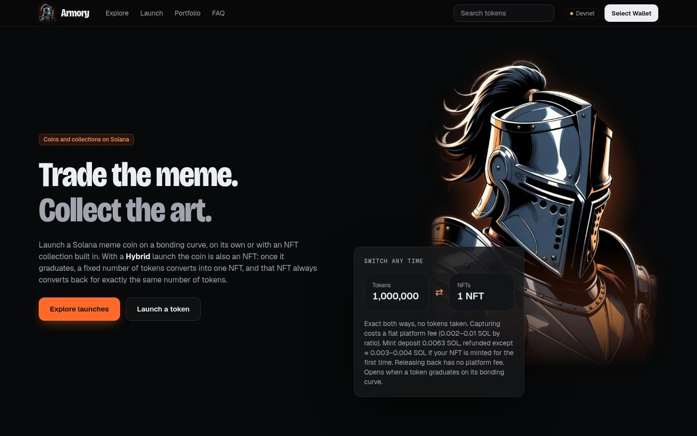
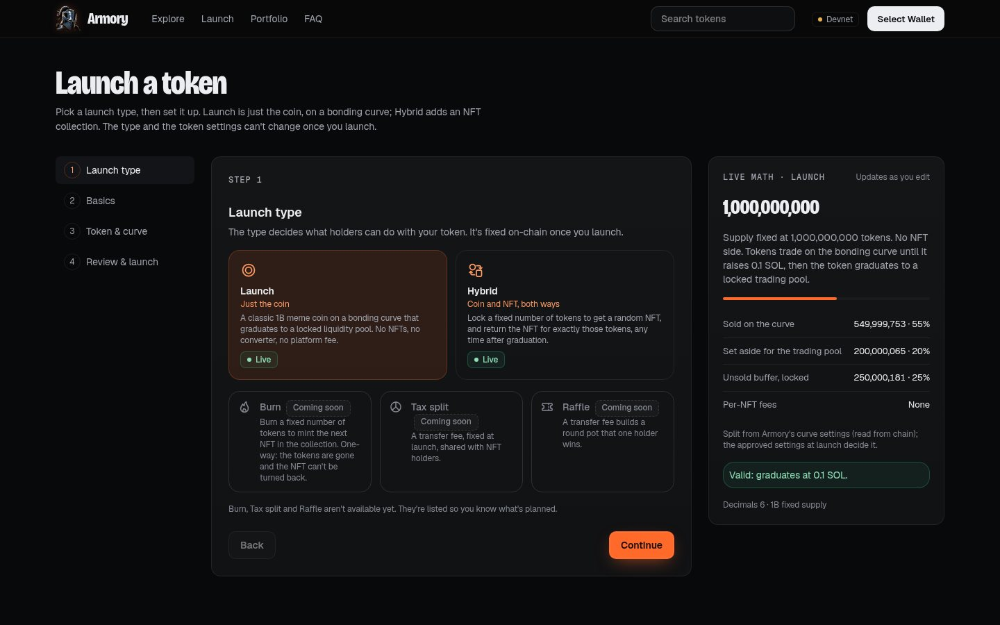
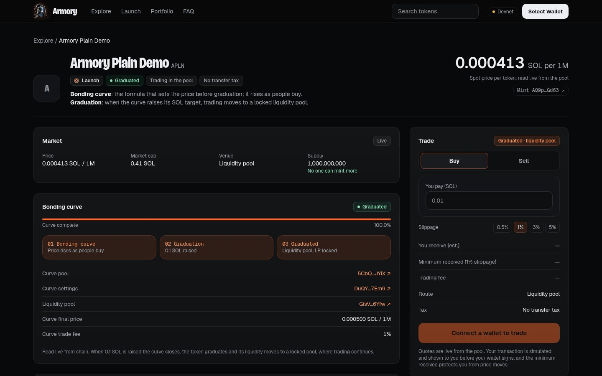
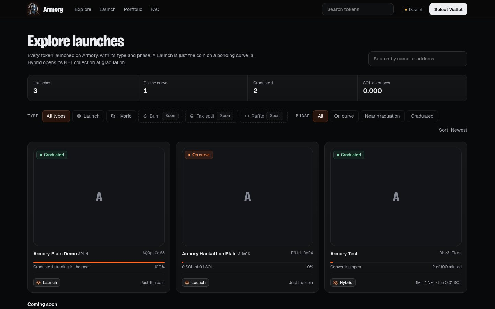
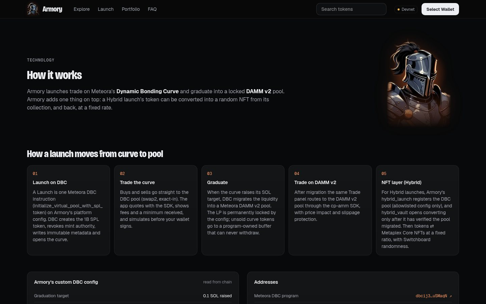
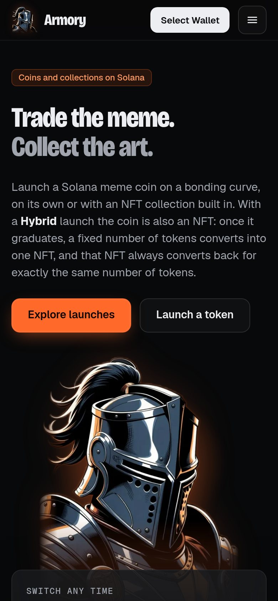
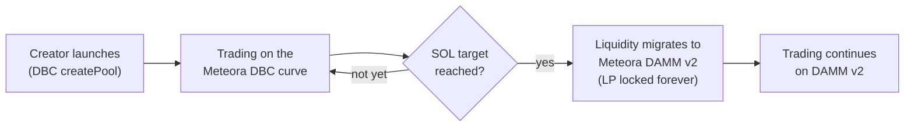

<p align="center">
  
</p>

<h1 align="center">Armory</h1>

<p align="center">
  <strong>Launch a Solana meme coin on a fair Meteora bonding curve, with an NFT collection built in if you want one.</strong>
</p>

<p align="center">
  <a href="https://armory-ten.vercel.app"><strong>Live demo →</strong></a>
  &nbsp;·&nbsp; <a href="HACKATHON.md">Hackathon submission</a>
  &nbsp;·&nbsp; <a href="docs/README.md">Docs</a>
</p>

<p align="center">
  
  
  
  
  
</p>

> **Devnet demo, unaudited.** Everything here runs on Solana devnet with test SOL. Nothing has real value, and
> nothing should be used with real funds.

<p align="center">
  
</p>

## What it is

Armory is a Solana launchpad for meme coins. A creator names a coin, picks a ticker and launches it in one
transaction. The coin trades on a **Meteora Dynamic Bonding Curve (DBC)**, where the price rises as people buy. When
the curve raises its SOL target, the coin **graduates**: its liquidity moves into a **Meteora DAMM v2** pool with the
LP permanently locked, and trading carries on from the same trade panel.

**Hybrid** launches are live on devnet too: the coin comes with an NFT collection built in. After graduation, a
fixed number of tokens (say 1,000,000) converts into one random NFT from the collection, and that NFT always converts
back into exactly the same number of tokens. Randomness comes from Switchboard, so nobody can pick the rare pieces.

**Try it:** open the two demo collections on the live site, [Forge Gems](https://armory-ten.vercel.app/t/PyngwuDKX8ZDfsY91wVXgX78fFmz4w9F6Zc7tjBdMMU)
(GEMS) and [Shieldwall](https://armory-ten.vercel.app/t/5VVsjp6oKi3mcSKb5YnvQ1MWZBPejqC57RLTqSy33ryE) (SHLD). Both
graduated on devnet and have minted NFTs. Connect a devnet wallet, buy some tokens, convert 1,000,000 of them into an
NFT, re-roll it, or release it back to tokens.

## Features

- **One-click launch.** A fixed 1,000,000,000 supply SPL token with mint and freeze authority revoked and immutable
  metadata, created straight from the browser with the Meteora DBC SDK. No Armory program sits in the path.
- **Trade on the curve and after graduation.** Live quotes, a slippage setting, minimum received, the trading fee
  and Meteora's protocol fee are all shown before you sign. The panel switches from the curve to the DAMM v2 pool
  automatically.
- **Live progress.** A progress bar shows SOL raised against the curve's graduation target, then the migrated pool.
- **Hybrid: coin and NFT, both ways.** Capture (tokens → a random NFT), re-roll (swap your NFT for another random
  one) and release (NFT → exactly the ratio in tokens). NFTs are Metaplex Core and are minted only when first captured.
  Art and metadata are uploaded from the browser to Irys.
- **Explore and portfolio.** Browse every launch read from chain, search by name or mint, and see your holdings.
- **Transaction safety pipeline.** Every transaction goes through a program allowlist, a simulation and a readable
  preview before an explicit confirm. Only then does your wallet sign. The app never holds private keys.
- **Trust page.** Plain-language list of what is locked, what isn't, and every program and config address.
- **Phantom and Solflare** wallets, a responsive dark UI and a comic-book knight mascot.

## Screenshots

| Launch a token | Token page and trading |
| --- | --- |
|  |  |
| **Explore** | **How it works (Meteora)** |
|  |  |

<p align="center"></p>

## How it works



1. **Launch.** The app calls `creator.createPool` on Armory's platform DBC config. The config fixes the curve, the
   fee, the SOL quote token and the graduation target, so every launch plays by the same published rules.
2. **Trade on the curve.** Buys and sells use `swapQuote2` for the quote and `swap2` (exact-in) for the transaction,
   always with a minimum-received amount.
3. **Graduate.** At the threshold, DBC migrates the liquidity to a DAMM v2 pool and the LP is permanently locked by
   the config. (On mainnet Meteora's keepers do this automatically; on devnet we call the permissionless migration
   ourselves.)
4. **Trade after graduation.** The trade panel switches to the DAMM v2 pool with its own quotes and price impact.
5. **Hybrid NFTs (Hybrid launches only).** Armory's vault opens only after it checks on-chain that the curve really
   migrated. Then anyone can lock the ratio of tokens to get a random NFT (Switchboard randomness), re-roll it for a
   small flat fee, or release it for exactly the ratio back. The vault holds the locked tokens; there is no admin withdraw, only release by an NFT holder.

Every address, the live config values and the exact code paths are on the in-app **How it works** page
([`/meteora`](https://armory-ten.vercel.app/meteora)). The full devnet proof (launch, buys, sells, graduation and
DAMM v2 trades, with signatures) is in [HACKATHON.md](HACKATHON.md).

## Tech stack

| Layer | Tools |
| --- | --- |
| Web app | Next.js 16 (App Router), React 19, TypeScript 5.9, Tailwind CSS 4 |
| Solana | `@solana/web3.js` 1.99, Solana wallet adapter (Phantom, Solflare) |
| Meteora | `@meteora-ag/dynamic-bonding-curve-sdk` 1.5.13, `@meteora-ag/cp-amm-sdk` 1.5.1 (DAMM v2) |
| On-chain (Hybrid) | Rust 1.89, Anchor 1.2, Solana/Agave 4.1.2, Metaplex Core, Switchboard On-Demand randomness |
| Testing | Vitest (web app), LiteSVM integration tests (programs) |
| Hosting | Vercel (devnet demo) |

## Run it locally

You need Node.js 20.19 or newer and a Solana wallet set to **devnet** with some devnet SOL from
[faucet.solana.com](https://faucet.solana.com).

```bash
git clone https://github.com/BartonBase/Launchpad1.git
cd Launchpad1/app
npm ci
cp .env.example .env.local              # then set NEXT_PUBLIC_SOLANA_CLUSTER=devnet
npm run dev                             # http://localhost:3000
```

Other useful scripts (from `app/`):

```bash
npm test                                          # unit tests (offline)
npm run typecheck && npm run lint
NEXT_PUBLIC_SOLANA_CLUSTER=devnet npm run build   # production build
```

No secrets are needed: every setting in `.env.example` is public. `app/README.md` covers all scripts, environment
variables and the transaction safety pipeline. To build and test the on-chain programs, see
[docs/DEV_SETUP.md](docs/DEV_SETUP.md) and [tests/README.md](tests/README.md).

**Deploying your own copy (Vercel or Netlify):** set the root directory to `app/`, the build command to
`npm run build`, and the environment variable `NEXT_PUBLIC_SOLANA_CLUSTER=devnet`.

## Project structure

```
.
├── app/                    Next.js web app (the Armory site)
│   ├── src/app/            Pages (home, launch, explore, token, portfolio, …)
│   ├── src/components/     UI, trade panel, launch wizard
│   ├── src/lib/meteora/    Meteora DBC + DAMM v2 integration
│   ├── src/lib/tx/         Transaction safety pipeline
│   ├── src/config/         Cluster, program IDs, configs
│   └── tests/              Vitest unit tests
├── programs/               Anchor programs (Hybrid)
│   ├── hybrid_launch/      Launch registry, DBC checks
│   └── hybrid_vault/       Token ⇄ NFT vault (opens after migration)
├── tests/                  LiteSVM integration tests for the programs
├── scripts/                Build, test and devnet deploy scripts
├── design/                 Design system and the knight mascot
├── docs/                   Architecture, ADRs, threat model
│   ├── security/           Security reviews and merged findings
│   ├── qa/                 Test plan, findings tracker and QA reports
│   └── screenshots/        Images used in this README
├── shelved/                Paused tax/raffle work (not built)
└── HACKATHON.md            Meteora DBC hackathon submission
```

## Roadmap

| Stage | Status |
| --- | --- |
| **Launch**: coin on a Meteora DBC curve, graduating to DAMM v2 | ✅ Live on devnet |
| Trading on the curve and on DAMM v2 after graduation | ✅ Live on devnet |
| **Hybrid**: coin plus an NFT collection that converts both ways | ✅ Live on devnet |
| Independent third-party audit of the Hybrid programs | 🔜 Planned before mainnet |
| **Burn**: burn tokens to mint an NFT (one-way) | 🔜 Coming soon: needs a fair random pick and a review ([proposal](docs/burn-mode-blind-assignment.md)) |
| **Tax split**: a fixed transfer tax shared with NFT holders | 🗺 Planned after Oct 12 ([roadmap](docs/tax-mode-design.md)) |
| Raffle launch type | 💤 Later |
| Mainnet | ⏸ After the audit |

## Security

Security comes first. The key properties:

- **Fixed supply.** Every coin has exactly 1,000,000,000 tokens; mint and freeze authority are revoked at launch.
- **Locked liquidity.** At graduation the DAMM v2 LP is permanently locked by the curve config.
- **No pause and no admin withdraw** in the Hybrid programs; each collection's tokens sit in its own program-owned
  vault, and releasing an NFT always returns exactly the collection's ratio of tokens.
- **Verifiable randomness** (Switchboard On-Demand) picks Hybrid NFTs, so nobody can choose which piece they get.
- **No keys in this repo.** No private keys, keypairs or `.env` files are committed; `.gitignore` excludes them.

The programs are **not audited yet**. The internal security reviews, threat models and the merged findings list are
in [docs/security/](docs/security/) and [docs/THREAT_MODEL.md](docs/THREAT_MODEL.md). If you find a security issue,
please open a GitHub issue without exploit details and we'll follow up privately.

## License

No open-source license has been chosen yet, so all rights are reserved for now. Please get in touch before reusing
the code or the mascot art.
