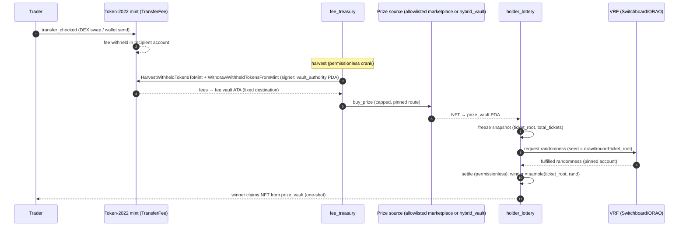
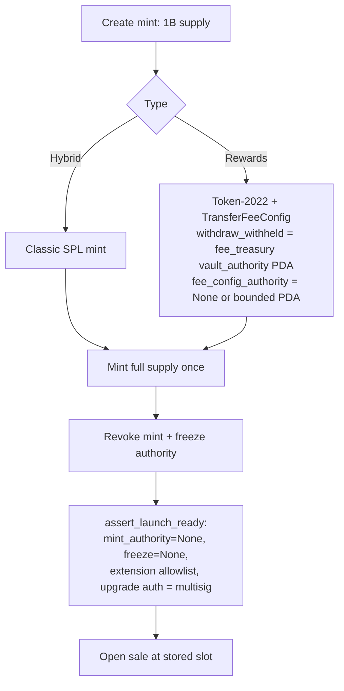

# On-chain architecture

Owner: Solana Program Engineer. Status: **scaffold (v0.1)**, localnet/devnet only. Not audited, not for mainnet.
Related: [DECISIONS.md](DECISIONS.md), [THREAT_MODEL.md](THREAT_MODEL.md), [transfer-tax-vs-wrap.md](transfer-tax-vs-wrap.md),
[DEV_SETUP.md](DEV_SETUP.md), master spec [BRIEF.md](BRIEF.md). Auditor inputs: `../security/auditor-a/`, `../security/auditor-b/`.

## Principles

1. **Use audited/standard programs wherever possible, and write custom code only where nothing standard exists.**
   There's no custom transfer-fee program (ADR-003). The one exception is the proposed `hybrid_vault` (ADR-008), because
   no standard program can do VRF-selected, no-peeking wraps.
2. **Minimal, revocable authorities.** Mint and freeze authority are revoked at launch. Fee authorities are program PDAs,
   not keys. Admin powers are limited to pausing and bounded parameter changes, and admin is a multisig before mainnet.
3. **The distribution layer (treasury, lottery, prizes) gets the heaviest scrutiny.** It holds pooled value and pays
   strangers, which is the pattern behind the incident the BRIEF names (see THREAT_MODEL.md §Stonk.fun).
4. **No outflow to a caller-chosen address.** Every destination is derived (PDA) or stored at init.

## Launch types (ADR-004, **Accepted by Barton 2026-09-24**; see transfer-tax-vs-wrap.md)

| | **Hybrid** (token ⇄ NFT) | **Rewards** (taxed) |
|---|---|---|
| Fungible mint | Classic SPL Token (`Tokenkeg…`) | Token-2022 (`TokenzQd…`) + TransferFeeConfig (+ MetadataPointer/TokenMetadata) |
| Supply | Exactly 1,000,000,000 × 10^decimals, minted once | same |
| Mint / freeze authority | Revoked (`None`) at launch | Revoked (`None`) at launch |
| Transfer tax | None | `bps` + `maximum_fee`, fee → fee_treasury |
| NFT | Metaplex Core collection + **`hybrid_vault`** (ADR-008, proposed; replaces MPL-Hybrid). Ratio `R` ∈ {10k, 50k, 100k, 200k, 1M}, `collection_size × R ≤ 1B` | none of its own; lottery prizes are bought NFTs |
| Rarity | Cosmetic only: every NFT redeems for exactly R. Traits come from a pre-committed list + VRF permutation | n/a |
| Converter | Yes, exact R both ways. Capture/re-roll are VRF-selected (two-step), release is instant | **No** |
| Custom programs involved | `hybrid_vault` (proposed) | `fee_treasury`, `holder_lottery` |

## Components

| Component | Kind | Program ID | Status |
|---|---|---|---|
| SPL Token | standard, audited | `TokenkegQfeZyiNwAJbNbGKPFXCWuBvf9Ss623VQ5DA` | hybrid fungible |
| Token-2022 (TransferFee) | standard, audited | `TokenzQdBNbLqP5VEhdkAS6EPFLC1PHnBqCXEpPxuEb` | rewards fungible + tax |
| Associated Token Account | standard | `ATokenGPvbdGVxr1b2hvZbsiqW5xWH25efTNsLJA8knL` | |
| Metaplex Core | Metaplex | `CoREENxT6tW1HoK8ypY1SxRMZTcVPm7R94rH4PZNhX7d` | NFT standard (devnet: executable ✔) |
| MPL-Hybrid (MPL-404) | Metaplex, **README says "Audit Pending"**, upgradeable by `mp14o4AQ…` | `MPL4o4wMzndgh8T1NVDxELQCj5UQfYTYEkabX3wNKtb` | **Not in the swap path under ADR-008.** Can't do no-choosing/no-peeking (hybrid-rarity-and-assignment.md §3.2). Reference only |
| **`hybrid_vault`** | **custom (planned, ADR-008)** | — | hybrid escrow: VRF capture/re-roll, exact release, trait commitment |
| Bonding curve / AMM | third party (TBD: Raydium CPMM / Meteora DAMM v2) | — | open question. Both support Token-2022 transfer-fee mints |
| **`fee_treasury`** | **custom (this repo)** | localnet `9mNyaZ3iDVdZKpdy6ZJvt3oPXTCYBisfPsqqzCaa7vsB` | scaffold: `initialize` only |
| **`holder_lottery`** | **custom (this repo)** | localnet `FJGixnazzvAQv2MFr5sABnKsm8yKqJAvxwBiTXNKmVNg` | scaffold: `initialize` + ticket math |
| VRF | Switchboard On-Demand (preferred) or ORAO VRF | SB devnet `Aio4gaXjXzJNVLtzwtNVmSqGKpANtXhybbkhtAC94ji2` / mainnet `SBondMDrcV3K4kxZR1HNVT7osZxAHVHgYXL5Ze1oMUv`; ORAO `VRFzZoJdhFWL8rkvu87LpKM3RbcVezpMEc6X5GVDr7y` | open question (DECISIONS Q1) |
| Multisig (admin, upgrade authority) | Squads v4 | — | required before mainnet |

Program IDs above are localnet keypairs in `target/deploy/` (throwaway). Devnet deploys will get new IDs.

## Custom program 1: `fee_treasury`

Purpose: receive Token-2022 withheld transfer fees for one Rewards mint, and spend them on NFT prizes under hard caps.

**Accounts / PDAs**

| Account | Seeds | Notes |
|---|---|---|
| `TreasuryConfig` | `["treasury_config", fee_mint]` | one per Rewards mint. `fee_mint` must be owned by Token-2022 (`owner =` constraint) |
| `vault_authority` | `["vault_authority", config]` | data-less PDA. **Is the mint's `withdraw_withheld_authority`** and owns the fee vault ATA. Bump stored |
| fee vault | ATA(`vault_authority`, fee_mint, Token-2022) | planned |

`TreasuryConfig` fields: `version, bump, vault_authority_bump, paused, admin, fee_mint, max_spend_per_purchase,
max_spend_per_window, spend_window_seconds (1h..30d), window_start_ts, spent_in_window, total_harvested, total_spent`.

**Instructions**

- `initialize(params)`: done. Validates caps (`purchase > 0`, `purchase ≤ window`, window 1h..30d). A re-init
  fails because Anchor `init` refuses an existing account.
- `harvest` (planned, **permissionless**): `HarvestWithheldTokensToMint` over a bounded, paginated list of accounts,
  then `WithdrawWithheldTokensFromMint` → fee vault. Destination is fixed (vault ATA), signed by `vault_authority`.
- `buy_prize` (planned): spend from the vault only through a pinned route, capped per purchase and per window. Routes:
  - an allowlisted marketplace with an on-chain max price;
  - `hybrid_vault` `request_capture` at the fixed ratio (VRF-selected NFT) for an allowlisted Hybrid collection.
    This needs that collection's classic-SPL token, so the Rewards-token → Hybrid-token swap must use TWAP `min_out`.
    See DECISIONS Q3. The bought NFT goes **directly** to `holder_lottery`'s prize vault PDA. Any token→SOL leg
  needs on-chain `min_out` from a TWAP (Auditor B R-07).
- `set_paused`, `propose/execute_params` (planned): admin = multisig, timelocked, bounded.

## Custom program 2: `holder_lottery`

Purpose: pick prize winners among holders of a Rewards mint with sybil-neutral tickets, anti-sniping, and VRF.

**Accounts / PDAs**

| Account | Seeds | Notes |
|---|---|---|
| `LotteryConfig` | `["lottery_config", ticket_mint]` | `ticket_threshold > 0`, `min_holding_seconds` 24h..90d, `randomness_provider` |
| `prize_vault` | `["prize_vault", config]` | data-less PDA that owns prize NFTs/tokens. Bump stored |
| `Draw` (planned) | `["draw", config, round_le]` | one-way state machine `Open → SnapshotFrozen → RandomnessRequested → Fulfilled → Settled` (+ `Cancelled` after a deadline) |
| `Entry`/stake (planned) | `["entry", draw_or_config, owner]` | time-weighted stake or registration (see below) |
| `Claim` (planned) | `["claim", draw, winner]` | one-shot flag set **before** transfer |

**Ticket math** (`src/math.rs`, unit-tested): `tickets = floor(balance / ticket_threshold)` with `checked_div`.
Remainders are discarded, so splitting S across k wallets gives `Σ floor(s_i/t) ≤ floor(S/t)`, and splitting never
gains. A property test is included.

**Anti-snapshot-sniping (design, open question Q2).** Point-in-time balances are never used. The recommended
mechanism is opt-in registration/stake into a program vault, with tickets from time-weighted balance over the period
and a `min_holding_seconds` gate (Auditor B R-08). A transfer hook is avoided because it breaks permissionless DEX
pools (transfer-tax-vs-wrap.md §c).

**Randomness.** Switchboard On-Demand commit–reveal, or ORAO request/fulfill. The VRF account pubkey and seed are
pinned in `Draw` at request time, and the seed includes `draw || round || ticket_root`. `settle` is permissionless and
requires exactly that account. There's no re-request and no cancel after fulfillment. Winner index uses rejection
sampling (no `% n` bias) over a prefix-sum/merkle structure, O(log N).

## Flows

### Rewards launch: tax → treasury → prize → lottery



### Hybrid launch: exact convert via `hybrid_vault` (ADR-008, proposed)

```mermaid
sequenceDiagram
    autonumber
    participant U as Holder
    participant HV as hybrid_vault (PDA vault + sequenced pool)
    participant V as VRF
    participant K as Anyone / crank
    U->>HV: request_capture: exactly R tokens + fees locked (seq = s)
    HV->>V: request randomness (pinned account)
    V-->>HV: fulfilled
    K->>HV: settle(s): FIFO; candidates = pool deposits with seq < s
    HV-->>U: VRF-selected Core NFT (minted on first exit with Merkle-proven metadata)
    U->>HV: release(asset): NFT in (incoming, new seq)
    HV-->>U: exactly R tokens, same tx
    U->>HV: request_reroll(asset) + fee → settle → different random NFT
```

### Launch checklist (on-chain, enforced by tests/scripts before a sale opens)



## Authority map (target for mainnet)

| Authority | Holder | Revocable? |
|---|---|---|
| Mint authority (both types) | **None** after minting 1B | revoked at launch |
| Freeze authority | **None** | revoked at launch |
| Token-2022 `withdraw_withheld_authority` | `fee_treasury` `vault_authority` PDA | fixed by program |
| Token-2022 `transfer_fee_config_authority` | **None** (preferred) or a bounded, timelocked PDA | choice at launch (Q4) |
| Hybrid collection update authority + vault | `hybrid_vault` PDA. No metadata-update, add-plugin or withdraw instruction. Fee changes bounded + timelocked (multisig) | ratio/mint/trait_root immutable |
| `fee_treasury` / `holder_lottery` admin | Squads multisig. Pause + bounded, timelocked params only; **no withdraw** | |
| Program upgrade authority | Squads multisig, then `--final` after audit + stabilization | yes |

## Scaffold status

- Built with Anchor 1.2.0 / Solana 4.1.2, SBPF v2 (see DEV_SETUP.md). Tests: LiteSVM unit/integration per program and a
  localnet smoke test that creates a real Token-2022 TransferFee mint and calls both `initialize`s.
- Not implemented yet: harvest, buy_prize, draws, VRF integration, claims, pause, timelocks, `assert_launch_ready`.
