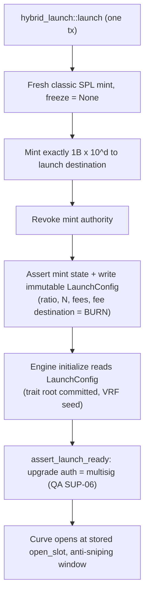
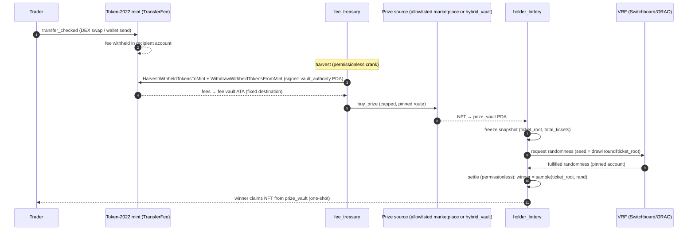

# On-chain architecture

> **CURRENT (2026-09-25):** flat SOL tier fee on capture/re-roll at request, to `PLATFORM_FEE_RECIPIENT`, never refunded
> (ADR-013); release free; **no burn, no token fee, no pause** (ADR-015); **lazy minting** from a per-request mint escrow
> (ADR-016, [lazy-mint-interface.md](lazy-mint-interface.md)); ratios {50k…5M}, 100 ≤ N ≤ 10,000; exits read a frozen
> LaunchConfig prefix (ADR-017). Older burn/bps/pause text below is historical.

Owner: Solana Program Engineer. Status: **v0.2 (2026-09-24, after ADR-009)**, localnet/devnet only. Not audited, not
for mainnet. Related: [DECISIONS.md](DECISIONS.md), [THREAT_MODEL.md](THREAT_MODEL.md),
[admin-multisig-timelock.md](admin-multisig-timelock.md), [hybrid-rarity-and-assignment.md](hybrid-rarity-and-assignment.md),
[qa-answers.md](qa-answers.md), [DEV_SETUP.md](DEV_SETUP.md), master spec [BRIEF.md](BRIEF.md). Auditor inputs:
`../security/auditor-a/`, `../security/auditor-b/`.

> **Scope (ADR-009, Barton 2026-09-24 2:51 PM MT):** **Track A only**, SPL-404 hybrid launches on a classic SPL Token.
> **Track B** (Token-2022 transfer tax for existing collections → tax treasury buying NFTs from the token's own existing
> collection → holder raffle) is **SHELVED/DEFERRED**; its design is kept at the end of this file, marked 💤.

## Principles

1. **Use audited/standard programs wherever possible; write custom code only where nothing standard exists.**
   `hybrid_launch` exists because the launch invariants must be enforced on-chain in one step; `hybrid_vault`
   (ADR-008, proposed) because no standard program does VRF-selected, no-peeking wraps.
2. **No authorities, no mutable economics (ADR-009 C3).** Mint and freeze authority are revoked at launch. Ratio,
   collection size, fees, fee destination and mint are fixed at init. The only admin power under consideration is an
   auto-expiring "pause new captures" that can never block unwrap
   ([admin-multisig-timelock.md](admin-multisig-timelock.md)).
3. **No operator wallet custodies value (ADR-009 C2).** Fees are burned; backing sits in program PDAs; nothing is
   swept by a person (the Stonk.fun failure, THREAT_MODEL.md §Stonk.fun).
4. **No outflow to a caller-chosen address.** Every destination is derived (PDA/ATA) or stored at init.

## Track A: SPL-404 hybrid launch

| Property | Value |
|---|---|
| Fungible mint | Classic SPL Token (`Tokenkeg…`). Token-2022 is rejected on-chain |
| Supply | Exactly 1,000,000,000 × 10^decimals, minted once by `hybrid_launch`. Nothing can mint or burn it afterwards (ADR-013: no burn) |
| Mint / freeze authority | Mint revoked in the same instruction; freeze never set |
| Transfer tax | None |
| Ratio `R` | ∈ {50k, 100k, 200k, 500k, 1M, 2.5M, 5M} whole tokens per NFT (10k dropped 2026-09-25); 100 ≤ N ≤ min(1B/R, 10,000) |
| Collection size `N` | `100 ≤ N` and `N × R ≤ 1B` (checked_mul). Max: 100,000 / 20,000 / 10,000 / 5,000 / 2,000 / 1,000 / 400 / 200 |
| NFT | Metaplex Core collection, cosmetic rarity; traits from a pre-committed list + VRF permutation (ADR-008) |
| Convert | Exact R both ways. Capture/re-roll are VRF-selected (blind); release is instant |
| Fees | One flat SOL tier fee for capture and re-roll (0.002/0.005/0.01 SOL, cap 0.01) to `PLATFORM_FEE_RECIPIENT`, at request, never refunded; release free; the requester also escrows the lazy-mint cost (ADR-013/016) |
| Copy | "Supply fixed at 1,000,000,000; nobody can mint more. Release is free and returns exactly N tokens." |

## Components

| Component | Kind | Program ID | Status |
|---|---|---|---|
| SPL Token | standard, audited | `TokenkegQfeZyiNwAJbNbGKPFXCWuBvf9Ss623VQ5DA` | hybrid fungible |
| Associated Token Account | standard | `ATokenGPvbdGVxr1b2hvZbsiqW5xWH25efTNsLJA8knL` | |
| **`hybrid_launch`** | **custom (this repo)** | localnet `9Loc4hQZJh4SuBCGPiPs1wAfwywUAM7av5upyGHfc6Q8` | **built + tested** (ADR-010): `launch` only |
| Engine: **`hybrid_vault`** | custom (ADR-008 **ACCEPTED** 2026-09-24) | localnet `BEfL9dccCUtgBVfLmJieeSr3ju29fpVqLM3NgttxqXqG` | in development on branch `wip/hybrid-vault`. MPL-Hybrid (`MPL4o4w…`) is reference only |
| Metaplex Core | Metaplex | `CoREENxT6tW1HoK8ypY1SxRMZTcVPm7R94rH4PZNhX7d` | NFT standard |
| Bonding curve / AMM | own or third party (TBD, N6) | — | open; anti-sniping is an open design item (admin-multisig-timelock.md §6) |
| VRF | Switchboard On-Demand (preferred) or ORAO | SB devnet `Aio4gaXjXzJNVLtzwtNVmSqGKpANtXhybbkhtAC94ji2` / mainnet `SBondMDrcV3K4kxZR1HNVT7osZxAHVHgYXL5Ze1oMUv`; ORAO `VRFzZoJdhFWL8rkvu87LpKM3RbcVezpMEc6X5GVDr7y` | open (DECISIONS Q1) |
| Multisig (upgrade authority, optional guardian) | Squads v4 | `SQDS4ep65T869zMMBKyuUq6aD6EgTu8psMjkvj52pCf` | required before mainnet |

Program IDs are localnet keypairs (throwaway). Devnet deploys will get new IDs.

## `hybrid_launch` (built)

**Accounts / PDAs**

| Account | Seeds / constraint | Notes |
|---|---|---|
| `creator` | signer, payer | recorded in `LaunchConfig` |
| `mint` | **fresh keypair, signer** | created by the program (82 bytes, owner classic SPL Token) |
| `LaunchConfig` | `["launch_config", mint]`, `init` | immutable; no update/close instruction |
| `mint_authority` | `["mint_authority", launch_config]` | data-less PDA; mint authority for one `mint_to`, then revoked |
| `launch_vault` | `["launch_vault", mint, launch_config]` | data-less PDA; owns the launch destination. Not caller-chosen; nothing signs for it (QA-HL-02, N2 decided) |
| `launch_destination` | classic ATA(`launch_vault`, mint) | receives all 1B; no withdraw instruction. Distribution (curve) TBD |
| `token_program` | `Program<Token>` | rejects Token-2022 |

**`launch(params)`** in one tx: create mint → `initialize_mint2` (freeze None) → create ATA → `mint_to` 1B × 10^d →
`set_authority(MintTokens, None)` → re-read and assert (owner, supply, decimals, authorities) → write `LaunchConfig`.
`params = {decimals ≤ 9, ratio_whole_tokens ∈ allowed set, collection_size (100..=1B/R), capture_fee_bps,
reroll_fee_bps (≤ 1000, capture ≥ re-roll), fee_destination = BURN}`.

`LaunchConfig` fields: `version, bump, mint_authority_bump, creator, mint, launch_destination, decimals,
total_supply_base, ratio_whole_tokens, ratio_base, collection_size, max_tokens_in_nft_form, capture_fee_bps,
reroll_fee_bps, capture_fee_amount, reroll_fee_amount, fee_destination (0 = BURN), launched_at`.

The engine reads `LaunchConfig` (pinned program ID + seeds) instead of taking its own ratio/fee parameters.

## Flows

### Hybrid launch: exact convert via `hybrid_vault` (ADR-008, proposed)

```mermaid
sequenceDiagram
    autonumber
    participant U as Holder
    participant HV as hybrid_vault (PDA vault + sequenced pool)
    participant V as VRF
    participant K as Anyone / crank
    U->>HV: request_capture: exactly R tokens → vault, token fee locked (seq = s)
    HV->>V: request randomness (pinned account)
    V-->>HV: fulfilled
    K->>HV: settle(s): FIFO; candidates = pool deposits with seq < s
    HV-->>U: VRF-selected Core NFT (minted on first exit with Merkle-proven metadata); token fee burned
    U->>HV: release(asset): NFT in (incoming, new seq)
    HV-->>U: exactly R tokens, same tx
    U->>HV: request_reroll(asset) + fee → settle → different random NFT, fee burned (no backing moves)
```

### Launch checklist (on-chain)



## Authority map (target for mainnet)

| Authority | Holder | Changeable? |
|---|---|---|
| Mint authority | **None** (revoked in `launch`) | no |
| Freeze authority | **None** (never set) | no |
| `LaunchConfig` (ratio, N, fees, fee destination, mint) | nobody | no instruction exists |
| Fee destination | `PLATFORM_FEE_RECIPIENT` code constant | no (program upgrade only) |
| Hybrid collection update authority + vault | engine PDA; no metadata-update, add-plugin or withdraw instruction | no |
| Pause new captures/re-rolls (if kept, N4) | Squads guardian (auto-expiring) or timelocked governance multisig; never blocks release | only reduces risk |
| Program upgrade authority | Squads governance vault PDA (7-day timelock proposed), then `--final` after audit + stabilization | yes, until frozen |

## Status

- Built with Anchor 1.2.0 / Solana 4.1.2, SBPF v2 (DEV_SETUP.md). `hybrid_launch`: 4 unit + 19 LiteSVM tests passing
  via `./scripts/test.sh`.
- Not implemented: the engine (blocked on Q-H1), VRF integration, pause, `assert_launch_ready`, curve.

---

## 💤 SHELVED: Track B (Token-2022 tax for existing collections)

**SHELVED/DEFERRED per ADR-009.** Kept as notes; do not build on it. Code: local branch `shelved/track-b-t22`
(`3916467`, WIP) and `shelved/` on `main` (excluded from the build). Track B was a Token-2022 transfer-fee token for an
**existing** NFT collection: harvested tax funded a treasury whose default would have been buying NFTs from the token's
own existing collection, given away by a holder raffle (floor(balance/threshold) tickets, VRF). Note that the
Stonk.fun findings (ADR-009) argue against a transfer tax of this kind at all.

### `fee_treasury` (renamed `tax_treasury` on branch `shelved/track-b-t22`)

Purpose: receive Token-2022 withheld transfer fees for one Rewards mint, and spend them on NFT prizes under hard caps.

**Accounts / PDAs**

| Account | Seeds | Notes |
|---|---|---|
| `TreasuryConfig` | `["treasury_config", fee_mint]` | one per Rewards mint. `fee_mint` must be owned by Token-2022 (`owner =` constraint) |
| `vault_authority` | `["vault_authority", config]` | data-less PDA. **Is the mint's `withdraw_withheld_authority`** and owns the fee vault ATA. Bump stored |
| fee vault | ATA(`vault_authority`, fee_mint, Token-2022) | planned |

`TreasuryConfig` fields: `version, bump, vault_authority_bump, paused, admin, fee_mint, max_spend_per_purchase,
max_spend_per_window, spend_window_seconds (1h..30d), window_start_ts, spent_in_window, total_harvested, total_spent`.

**Instructions**

- `initialize(params)`: done. Validates caps (`purchase > 0`, `purchase ≤ window`, window 1h..30d). A re-init
  fails because Anchor `init` refuses an existing account.
- `harvest` (planned, **permissionless**): `HarvestWithheldTokensToMint` over a bounded, paginated list of accounts,
  then `WithdrawWithheldTokensFromMint` → fee vault. Destination is fixed (vault ATA), signed by `vault_authority`.
- `buy_prize` (planned): spend from the vault only through a pinned route, capped per purchase and per window. Routes:
  - an allowlisted marketplace with an on-chain max price;
  - `hybrid_vault` `request_capture` at the fixed ratio (VRF-selected NFT) for an allowlisted Hybrid collection.
    This needs that collection's classic-SPL token, so the Rewards-token → Hybrid-token swap must use TWAP `min_out`.
    See DECISIONS Q3. The bought NFT goes **directly** to `holder_lottery`'s prize vault PDA. Any token→SOL leg
  needs on-chain `min_out` from a TWAP (Auditor B R-07).
- `set_paused`, `propose/execute_params` (planned): admin = multisig, timelocked, bounded.

### `holder_lottery`

Purpose: pick prize winners among holders of a Rewards mint with sybil-neutral tickets, anti-sniping, and VRF.

**Accounts / PDAs**

| Account | Seeds | Notes |
|---|---|---|
| `LotteryConfig` | `["lottery_config", ticket_mint]` | `ticket_threshold > 0`, `min_holding_seconds` 24h..90d, `randomness_provider` |
| `prize_vault` | `["prize_vault", config]` | data-less PDA that owns prize NFTs/tokens. Bump stored |
| `Draw` (planned) | `["draw", config, round_le]` | one-way state machine `Open → SnapshotFrozen → RandomnessRequested → Fulfilled → Settled` (+ `Cancelled` after a deadline) |
| `Entry`/stake (planned) | `["entry", draw_or_config, owner]` | time-weighted stake or registration (see below) |
| `Claim` (planned) | `["claim", draw, winner]` | one-shot flag set **before** transfer |

**Ticket math** (`src/math.rs`, unit-tested): `tickets = floor(balance / ticket_threshold)` with `checked_div`.
Remainders are discarded, so splitting S across k wallets gives `Σ floor(s_i/t) ≤ floor(S/t)`, and splitting never
gains. A property test is included.

**Anti-snapshot-sniping (design, open question Q2).** Point-in-time balances are never used. The recommended
mechanism is opt-in registration/stake into a program vault, with tickets from time-weighted balance over the period
and a `min_holding_seconds` gate (Auditor B R-08). A transfer hook is avoided because it breaks permissionless DEX
pools (transfer-tax-vs-wrap.md §c).

**Randomness.** Switchboard On-Demand commit–reveal, or ORAO request/fulfill. The VRF account pubkey and seed are
pinned in `Draw` at request time, and the seed includes `draw || round || ticket_root`. `settle` is permissionless and
requires exactly that account. There's no re-request and no cancel after fulfillment. Winner index uses rejection
sampling (no `% n` bias) over a prefix-sum/merkle structure, O(log N).

### Track B flow (shelved): tax → treasury → prize → lottery



